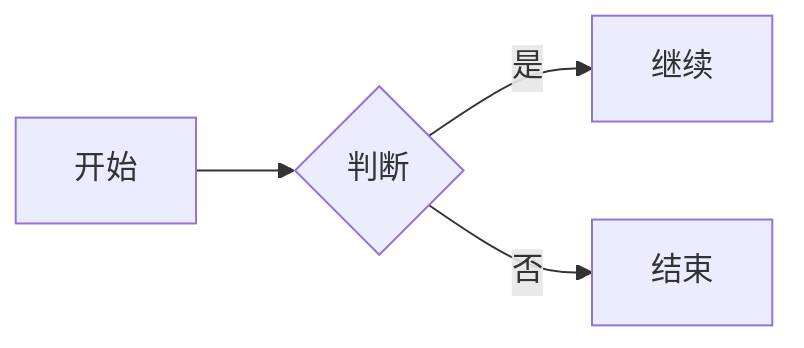
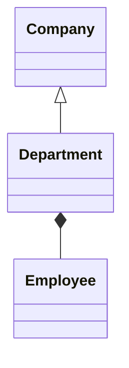
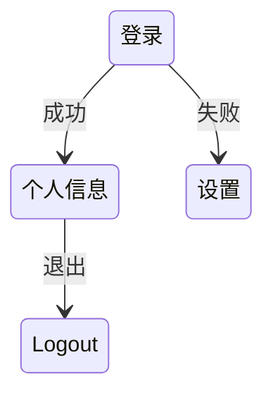

Mermaid 是一个用于生成标准的文本格式图表和流程图的轻量级工具，可以在 Markdown 文件中使用。以下是一些示例测试数据：

```markdown
## 测试数据示例

### 流程图示例

```

### 甘特图示例
```mermaid
gantt
    click J, "中止任务J"
    click K, "恢复任务K"
    :javascript
    const gantt = document.querySelector("#gantt")
    gantt.addEventListener("click", (event) => {
      if(event.target.getAttribute("data-tip")){
        alert(event.target.getAttribute("data-tip"))
      }
    })
```
```

### 组织结构图示例

```

### 状态图示例

```

### 时间线示例
```mermaid
timeline
    :format-options "horizontal=true"
    A[事件A] --> B{事件B}
    C[事件C] --> D[事件D]
```
```

这些示例可以帮助您了解如何使用 Mermaid 绘制不同类型的图表。请记住，Mermaid 支持多种格式的图表，包括流程图、甘特图、
组织结构图、状态图和时间线图等。