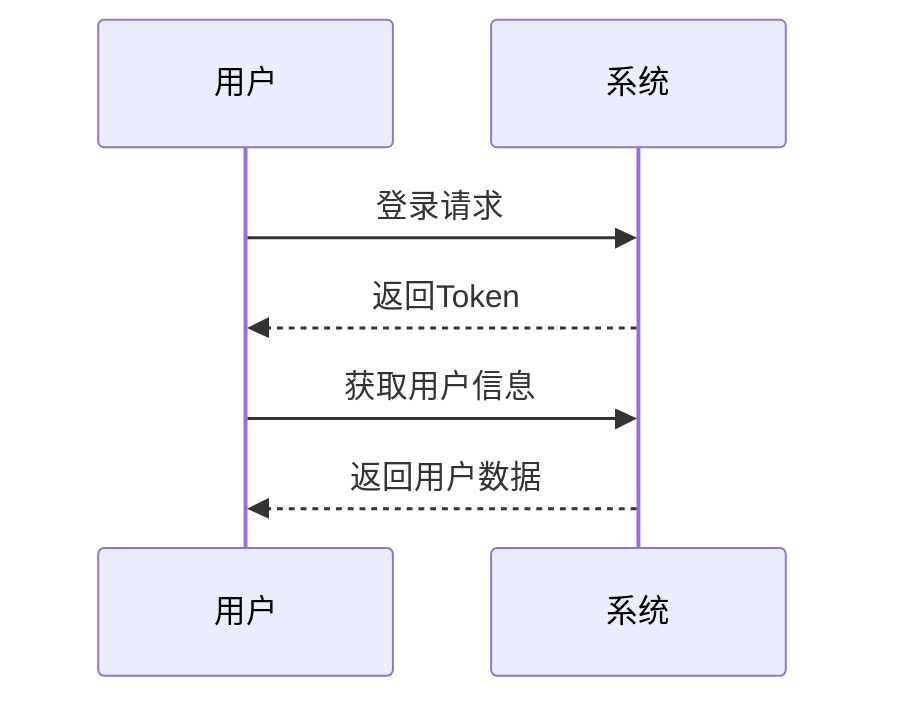
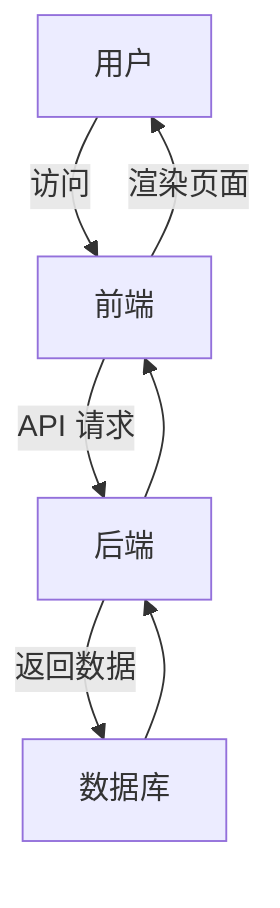

# 📝 Markdown 编辑器演示

欢迎使用本编辑器！它支持多种增强功能，包括图表渲染、代码运行、组件预览等。

---

## ✨ 基础 Markdown 功能

- 支持 **加粗**、*斜体*、`行内代码`
- 支持 [超链接](https://example.com)
- 支持图片、引用、列表等常规 Markdown 语法
- 分隔线与标题：`---` 与 `#  ##  ###`
- 支持数学公式：行内公式 $E = mc^2$ 和块级公式
- 支持任务列表（Task Lists）：`- [ ]` 和 `- [x]` 语法

---

## ✅ 任务列表（Task Lists）

支持 GitHub 风格的任务列表语法，可以创建带复选框的待办事项列表：

**基础用法**：使用 `- [ ]` 表示未完成任务，使用 `- [x]` 或 `- [X]` 表示已完成任务

- [ ] 未完成的任务项
- [x] 已完成的任务项
- [X] 已完成的任务项（大写 X 也可以）
- [ ] 嵌套任务列表
  - [x] 子任务 1
  - [ ] 子任务 2
  - [x] 子任务 3

**特性说明**：
- 支持嵌套任务列表
- 复选框默认禁用状态（仅用于展示）
- 可通过配置启用交互式复选框
- 自动添加 CSS 类名便于样式定制

**语法示例**：
```markdown
- [ ] 待办事项 1
- [x] 已完成事项 1
- [ ] 待办事项 2
  - [x] 子任务 1
  - [ ] 子任务 2
```

---

## 🔢 数学公式

支持 LaTeX 数学公式渲染，基于 KaTeX 引擎：

**行内公式**：使用单个 `$` 包裹，例如 $E = mc^2$，或 $\int_{-\infty}^{\infty} e^{-x^2} dx = \sqrt{\pi}$

**块级公式**：使用双 `$$` 包裹：

$$
\begin{aligned}
\nabla \times \vec{\mathbf{B}} -\, \frac1c\, \frac{\partial\vec{\mathbf{E}}}{\partial t} &= \frac{4\pi}{c}\vec{\mathbf{j}} \\
\nabla \cdot \vec{\mathbf{E}} &= 4 \pi \rho \\
\nabla \times \vec{\mathbf{E}}\, +\, \frac1c\, \frac{\partial\vec{\mathbf{B}}}{\partial t} &= \vec{\mathbf{0}} \\
\nabla \cdot \vec{\mathbf{B}} &= 0
\end{aligned}
$$

**常用公式示例**：

$$
\begin{matrix}
a & b \\
c & d
\end{matrix}
\quad
\begin{pmatrix}
a & b \\
c & d
\end{pmatrix}
\quad
\begin{bmatrix}
a & b \\
c & d
\end{bmatrix}
\quad
\begin{vmatrix}
a & b \\
c & d
\end{vmatrix}
$$

$$
x = \frac{-b \pm \sqrt{b^2-4ac}}{2a}
$$

$$
\sum_{i=1}^{n} i = \frac{n(n+1)}{2}
$$

$$
\lim_{n \to \infty} \left(1 + \frac{1}{n}\right)^n = e
$$

---
## 🎨 Mermaid 图表

支持流程图、时序图、状态图等，基于 Mermaid 渲染：



```svg
<svg width="200" height="200" xmlns="http://www.w3.org/2000/svg">
  <circle cx="100" cy="100" r="80" fill="steelblue" />
  <text x="100" y="100" text-anchor="middle" fill="white" font-size="20">
    SVG
  </text>
</svg>
```

| 功能                       | 写法                            | 效果                       | 说明               |
| :----------------------- | :---------------------------- | :----------------------- | :---------------- |
| **加粗**                   | `**bold**`                    | **bold**                 | 强调关键词或标题       |
| *斜体*                     | `*italic*`                    | *italic*                 | 突出重点内容         |
| `代码块`                    | `` `code` ``                  | `code`                   | 适合短代码或变量名     |
| [超链接](https://vuejs.org) | `[Vue.js](https://vuejs.org)` | [Vue.js](https://vuejs.org) | 点击跳转外部网站       |
| 图片                       | ``                    | （预览区显示图片）            | 可嵌入外链或本地图片   |

### 数据表格示例

| 日期     | 访问量 (PV) | 独立访客 (UV) |    转化率   |
| :----- | -------: | --------: | :------: |
| 周一     |     1024 |       768 |   5.2%   |
| 周二     |     1540 |      1120 |   6.1%   |
| 周三     |     1875 |      1320 |   6.8%   |
| 周四     |     1322 |      1010 |   5.9%   |
| **合计** | **5761** |  **4218** | **6.0%** |

```echarts
{
  "title": { "text": "月度销售趋势", "left": "center" },
  "tooltip": { "trigger": "axis" },
  "legend": { "data": ["线上", "线下"], "top": "10%" },
  "xAxis": { "type": "category", "data": ["1月", "2月", "3月", "4月", "5月", "6月"] },
  "yAxis": { "type": "value" },
  "series": [
    { "name": "线上", "type": "bar", "data": [820, 932, 901, 934, 1290, 1330] },
    { "name": "线下", "type": "line", "data": [620, 732, 801, 734, 1090, 1130] }
  ]
}
```
```markmap
# 前端工程化
- 构建工具
  - Vite
  - Webpack
- 框架生态
  - Vue 3
  - React
- 状态管理
  - Pinia
  - Redux
```

```vue
<template>
  <div class="p-4 border rounded-md text-center text-green-600 bg-green-50">
    <n-button type="primary" @click="count++">点击次数：{{ count }}</n-button>
  </div>
</template>

<script setup>
import { ref } from 'vue'
const count = ref(0)
</script>
```
```javascript
function fibonacci(n) {
  if (n <= 1) return n;
  return fibonacci(n - 1) + fibonacci(n - 2);
}

console.log("前 10 个斐波那契数列：", Array.from({ length: 10 }, (_, i) => fibonacci(i)));
```
```svg
<svg width="300" height="200" xmlns="http://www.w3.org/2000/svg">
  <rect width="300" height="200" rx="16" fill="#1E40AF" />
  <circle cx="80" cy="100" r="40" fill="#F59E0B" />
  <circle cx="220" cy="100" r="40" fill="#10B981" />
  <text x="150" y="105" text-anchor="middle" fill="white" font-size="22">SVG</text>
</svg>
```
| 功能模块          | 支持状态 | 说明              |
| :------------ | :--: | :-------------- |
| Markdown 基础语法 |   ✅  | 支持标题、引用、列表等     |
| 任务列表          |   ✅  | GitHub 风格，支持嵌套     |
| 表格语法          |   ✅  | 自动样式美化          |
| 数学公式          |   ✅  | LaTeX 语法，KaTeX 渲染 |
| Mermaid 图     |   ✅  | 支持流程图、时序图       |
| ECharts 图表    |   ✅  | JSON 一键渲染       |
| Markmap 思维导图  |   ✅  | 自动解析大纲          |
| Vue 组件运行      |   ✅  | 实时渲染 SFC        |
| JS 代码执行       |   ✅  | Web Worker 隔离运行 |
| SVG 内嵌图形      |   ✅  | 支持矢量展示          |
