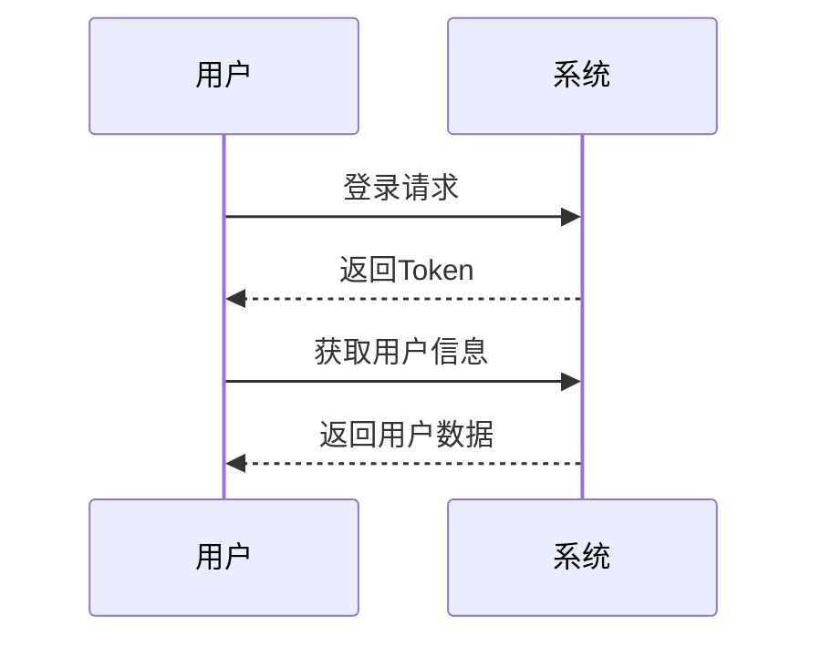

# 📝 Markdown 编辑器演示

欢迎使用本编辑器！它支持多种增强功能，包括图表渲染、代码运行、组件预览等。

---

## ✨ 基础 Markdown 功能

- 支持 **加粗**、*斜体*、`行内代码`
- 支持 [超链接](https://example.com)
- 支持图片、引用、列表等常规 Markdown 语法
- 分隔线与标题：`---` 与 `#  ##  ###`

---

## 🎨 Mermaid 图表

支持流程图、时序图、状态图等，基于 Mermaid 渲染：


## svg 图表

```svg
<svg width="200" height="200" xmlns="http://www.w3.org/2000/svg">
  <circle cx="100" cy="100" r="80" fill="steelblue" />
  <text x="100" y="100" text-anchor="middle" fill="white" font-size="20">
    SVG
  </text>
</svg>
```

---

## 🧠 思维导图（Markmap）

自动将 Markdown 大纲结构转为交互式思维导图：

```markmap
# Vue 组件通信

- Props 和 Emits
- 插槽（Slots）
- 跨组件通信
  - provide/inject
  - 事件总线（event）
  - 全局状态管理（如 Pinia）
```

> ✅ 当前编辑器已支持 Markmap 思维导图渲染

---

## 📊 ECharts 图表支持

通过 JSON 直接生成 ECharts 图表：

```echarts
{
  "title": { "text": "周销售额" },
  "tooltip": {},
  "xAxis": { "data": ["周一", "周二", "周三", "周四"] },
  "yAxis": {},
  "series": [{ "type": "line", "data": [120, 200, 150, 80] }]
}
```

---

## ⚙️ JavaScript 代码运行（Web Worker）

可直接运行 JS 代码，支持输出与错误捕获：

```javascript
function greet(name) {
  return `你好，\${name}！`;
}
console.log(greet("编辑器用户"));
```

---

## 🧩 Vue 3 组件运行（@vue/repl）

实时运行 Vue 3 单文件组件（SFC）：

```vue
<template>
  <div class="p-2 text-green-600 border rounded">
    ✅ 这是一个运行中的 Vue 组件！
  </div>
</template>
```

---
